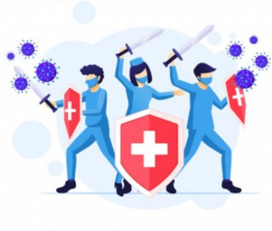

# CovidHero: A Tribute to the frontline warriors of Covid-19

Web Technologies used: HTML, CSS, JS, Bootstrap

IDE: VS-Code

Industry*: Health

Project Title*: Covid19 Heroes Donation Website

Problem Statement/Opportunity*: A novel strain of coronavirus — SARS-CoV-2 — was first detected in December 2019 in Wuhan, a city in China’s Hubei province with a population of 11 million, after an outbreak of pneumonia without an obvious cause. Our heroes don’t wear capes, they wear masks and white coats; our heroes don’t fight monsters, they fight pandemics. The corona-virus pandemic outbreak has created panic all around the world. People are forced to stay indoors and are asked to follow social distancing. As you sit in front of your television screens, cribbing about being forcefully confined to your home because of the pandemic, there are heroes who have been fighting out there, with the brightest smiles on their faces.To Help in the crises we developed a website so that public can reach ,donate,register as volunteers in the time of panic situations or in emergency.

Project Description*: core Idea of Project is to build an sample prototype Website for all the Covid19 Worriers with the help of HTML, CSS, JAVASCRIPT, BOOTSTRAP. . The primary goal of sample prototype an Website is to donate, register as volunteer online with solving problems during the covid crises This project deals with developing an website for Online Donation for Health Workers . We are using Azure Technologies with GitHub to complete this project.

Primary Azure Technology*:  Static Web Apps,

Other Azure Technologies: App Service

Link for the website:https://icy-sand-069356f10.1.azurestaticapps.net/

A novel strain of coronavirus — SARS-CoV-2 — was first detected in December 2019 in Wuhan, a city in China’s Hubei province with a population of 11 million, after an outbreak of pneumonia without an obvious cause. The virus has now spread to over 200 countries and territories across the globe, and was characterised as a pandemic by the World Health Organization (WHO) .

## Our Heroes
- ***Medical Workers*** -We have doctors, nurses, pharmacists, paramedical staffs and lab technicians.
- ***Security Officers***- We have police, security guards, relief officers in pandemic management.
- ***Farmers***- We have farmers, airline workers, delivery boy, ambulance drivers, shop-owners and teachers.

## About our heroes
Our heroes don’t wear capes, they wear masks and white coats; our heroes don’t fight monsters, they fight pandemics.
The corona-virus pandemic outbreak has created panic all around the world. People are forced to stay indoors and are asked to follow social distancing. As you sit in front of your television screens, cribbing about being forcefully confined to your home because of the pandemic, there are heroes who have been fighting out there, with the brightest smiles on their faces.

## Respect our Heroes
After witnessing these selfless services, every human would agree that our heroes are not those who jump floors on our screens but those who get out of their protective shelters to provide us with vegetables and groceries. Our heroes are not the ones who have superpowers but the ones who without any powers, are out there helping us during the pandemic outbreak. All the doctors, nurses, delivery boys and all other people who are helping us during this time need special applause.
Even with millions in our accounts, we are incapable of paying for the kind of work they have been doing in this tough time. A salute, a clap, a few words of appreciation might not make much difference to you but it's sure to make a difference in the lives of those providing us essential services.

